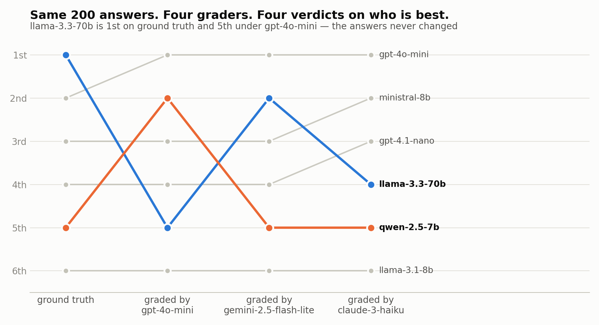
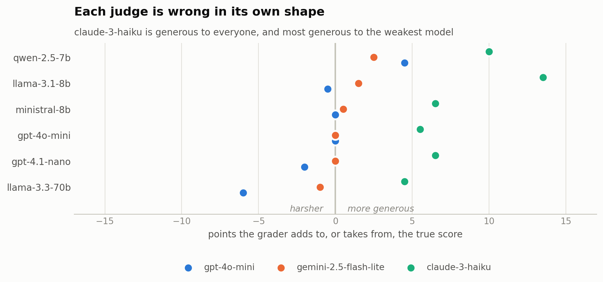

# leaderboard-audit

[](https://github.com/vahit19/leaderboard-audit/actions/workflows/ci.yml)

**Your eval says the new model is better. Can it tell?**

Six models. 200 GSM8K problems. Every answer graded four ways — once against
ground truth, once by each of three LLM judges. $0.49 of API spend. The model
that ranks 1st ranks 5th, depending only on who grades.

<picture>
  <source media="(prefers-color-scheme: dark)" srcset="figures/ranks-by-grader-dark.png">
  
</picture>

```
git clone https://github.com/vahit19/leaderboard-audit && cd leaderboard-audit
pip install numpy
python demo.py     # full pipeline offline: no key, no spend
```

`numpy` is the only requirement for everything but a live run. Every
statistical test is implemented here and checked against hand-computed values —
including the ones quoted on this page, which CI re-derives from the shipped
tables on every push.

---

## The finding

**The judges are not flaky.** Graded three times at temperature 0,
`gpt-4o-mini` returned the same verdict on **98.3%** of answers; all 3,592 of
its replies followed the required format; it agreed with ground truth **93.1%**
of the time. By every check an evaluation normally runs, it is healthy.

Its error is simply not spread evenly across systems.

<picture>
  <source media="(prefers-color-scheme: dark)" srcset="figures/grader-bias-dark.png">
  
</picture>

`gpt-4o-mini` is 6.0 points harsh to one model and 4.2 generous to another
(Holm-corrected *p* = .005 on the first) — a 10.2-point spread, on a benchmark
where the real gaps between the top five are one to five points.
`claude-3-haiku` is generous to everyone and most generous to the weakest
model, compressing the very gap the benchmark exists to measure.
`gemini-2.5-flash-lite`, the cheapest of the three, is by some distance the
most accurate.

**This is bias, not noise, and that is the whole point.** Every repeat is wrong
in the same direction, so repeat grading confirms it rather than revealing it.
Only a second grader on the same answers exposes it.

And on the deterministic table, five of the six models — spanning 89.5% to
95.0% — **cannot be told apart at all** at 200 items. The audit reports two
tiers, not six ranks.

<details>
<summary>Checks run before believing any of this</summary>

- All 13 answers `gpt-4o-mini` marked wrong and the numeric scorer marked right
  were **read by hand**. Every one ends with the correct value stated plainly
  ("The final answer is: 2" against a reference of 2). The extractor is right
  and the judge is wrong, not the other way round.
- A verbosity mechanism was **tested and rejected**: longer answers were graded
  *more* generously, and llama-3.3-70b is among the shortest. With six systems
  nothing at the model level is establishable anyway. The bias is measured; its
  mechanism is not explained here.
- `gpt-4o-mini` appears as both a system and a judge, so its own column is
  self-graded. It rises to 1st under all three judges, including the two from
  other labs, so this does not explain the pattern — but it is a confound and
  is named rather than buried.
- 200 items, six systems, one benchmark, one task type. Nothing here
  generalises beyond that without more runs.

</details>

---

## Use it

```
la estimate --items q.jsonl --systems a,b,c --scorer judge:m   # cost, no calls
la run      --items q.jsonl --systems a,b,c --budget 5         # measure
la audit    run/scores.csv                                     # what holds up
la compare  truth.csv judge.csv                                # grader bias
```

`pip install -e .` gives you `la`. Without installing anything, `python la.py`
takes the same arguments.

`run` refuses to start without `--budget`. The loop calls a paid API once per
cell, and a loop that works perfectly and bills all night is the failure mode
that matters.

**`audit`** reports how many tiers the data separates (pairwise family
Holm-corrected — for 31 systems that is 465 tests, about 23 of which come back
significant on pure noise uncorrected), each system's bootstrap rank interval,
the split of variance into item / system / repeat-run, the smallest difference
the table could resolve, and which pairs more items would fix versus which are
simply tied. Items are the resampling unit, so every replicate stays a complete
table and pairing holds.

**`compare`** takes two graders over the same answers and reports per-system
bias, paired over items and Holm-corrected, plus what it does to the ordering.

---

## Built for runs that cost money

Every call is **cached by content**, including the repeat index — in the run
above all 3,600 gradings reused cached answers and not one answer was
regenerated. A run killed at cell 400 of 600 resumes by replaying 400 hits.

A published run **replays offline**: ship the cache and `--offline` reproduces
it with no key and no network, verified here cell for cell. A cache miss raises
instead of quietly going online, so a reproduction cannot silently become a
fresh paid run.

The **budget is checked before each call**, priced from the provider's live
model list. Errored cells are recorded and excluded with a count — dropping
them silently would bias results toward whichever systems fail least on hard
items. A grade that does not parse is scored 0 and flagged, never discarded.
Work is ordered item-major, so an interrupted run still pairs.

---

## Reproduce

The run tables are in the repository, so the analysis needs no API key:

```bash
python la.py audit   run_gsm8k_numeric/scores.csv
python la.py compare run_gsm8k_numeric/scores.csv run_gsm8k_judge/scores.csv
python la.py compare run_gsm8k_numeric/scores.csv run_j_gemini-2.5-flash-lite/scores.csv
python la.py compare run_gsm8k_numeric/scores.csv run_j_claude-3-haiku/scores.csv
python figures/make_figures.py                       # needs matplotlib
```

`python tests/test_published.py` re-derives every number on this page from
those tables, so the claims here are checked rather than asserted. With
`test_stats.py`, `test_audit.py`, `test_system.py` and `test_compare.py` that
is 122 tests, none touching the network, all run by CI on Linux and Windows
against Python 3.9 and 3.12 — including the quickstart above, exactly as
printed.

<details>
<summary>Input formats and one measurement trap</summary>

Items as JSONL or CSV, or `hf:<dataset>`:

```json
{"id": "q001", "question": "What is 17 * 23?", "answer": "391"}
```

Field names are given with `--prompt-field` / `--reference-field` rather than
guessed. Or audit a table you already have: `system,item,run,score`. A
published leaderboard is wide — one row per system, one aggregate number — and
that shape has already discarded everything needed to say whether the ordering
means anything.

The trap: the default system prompt tells the model to answer directly, which
suppresses step-by-step reasoning. On GSM8K that cost about 40 points before
`--system-prompt` existed. Set it deliberately.

</details>

<details>
<summary>Layout</summary>

```
src/la/
  cli.py         estimate / run / audit / compare
  tasks.py       item loading: JSONL, CSV, Hugging Face
  providers.py   OpenRouter, offline replay, simulator
  judge.py       exact, contains, numeric, model judge, judge panel
  run.py         the measurement loop: resumable, bounded, item-major
  cache.py       content-addressed cache, atomic writes
  budget.py      spend accounting and the hard stop
  data.py        long-table loading, missing cells, repeat runs
  ranks.py       bootstrap rank intervals, pairwise family, tiers
  variance.py    item / system / repeat-run split, noise floor
  compare.py     per-system grader bias and what it does to the ordering
  stats/         exact Wilcoxon and sign test, Holm, bootstrap, power,
                 inverse normal CDF — so scipy is not needed
figures/         the two figures above, light and dark, plus their data
```

</details>

## What it does not do

It does not say whether a benchmark measures anything worth measuring, or
whether scores transfer to deployment. It can say a grader is *wrong*, but only
against a grader you trust more. Without one it measures *consistency*, not
correctness — and the result above is why those are not the same question.

Apache-2.0.
